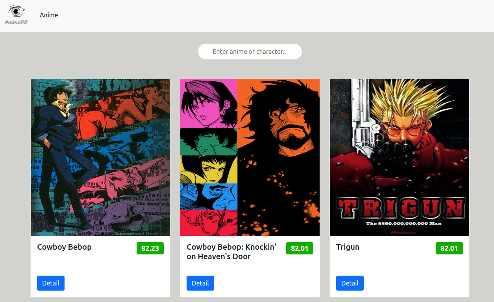

# AnimeDB

I created AnimeDB. I used [Kitsu API](https://kitsu.docs.apiary.io/#) Docs.

- I've used async function,
- I've created detail page
- I've fetched searched box

---

[Click to see the Project](https://ayerdelen.github.io/AnimeDB)

---

